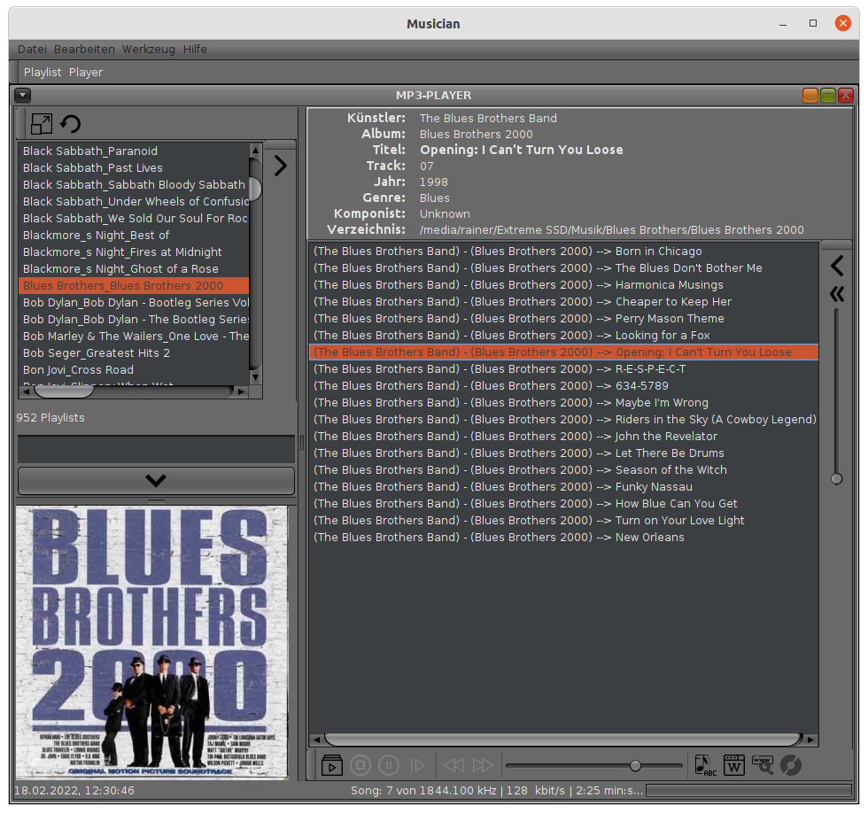

---
title: Musician
--- 

Musician ist ein einfach zu nutzendes Programm zum Abspielen von MP3-Dateien.
Es hilft Ihnen beim Anlegen von Playlists und dem Bearbeiten der wichtigsten MP3-Tags.  

Das Verwalten ihrer gesammelten MP3-Dateien in einer geordneten Musiksammlung
wir zum Kinderspiel.

Zusätzliche Informationen zum aktuellen Musikstück wie etwa Songtexte, Infos zum Künstler
mit Bild oder eine Discogs-Abfrage sind per Mausklick aus dem Internet abrufbar.

  
*Der Player*  

## Systemvoraussetzungen

Musician wurde in Java mit dem JDK 17.01 programmiert und kann in jeder Umgebung ausgeführt
werden, die ein Java Runtime Environment (JRE) der Version 17.01 oder höher bereitstellt.  

Musician wurde unter **Ubuntu 20.04** und **Windows 10** erfolgreich getestet.

## Download

Sie können Musician kostenlos herunterladen und nutzen.

<a href="Musician_install.zip">Musician downloaden</a>  

Musician is completely free to use for both individuals and businesses,
and includes no ads or unwanted software.

music on, world off ;-)
